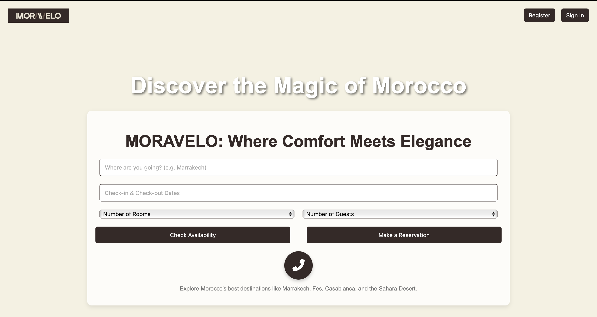

## About me
I am a software engineer specializing in Data Engineering and Generative AI. My expertise lies in building scalable data pipelines, 
optimizing cloud-based architectures, and leveraging AI to create intelligent solutions. With a strong foundation in distributed computing, 
machine learning, and data analytics, I am passionate about transforming raw data into meaningful insights and innovative applications. 
My work spans cloud platforms like Azure and GCP, and I thrive on solving complex problems with cutting-edge technologies.
# Skills

## Programming Languages

Python (Pandas, NumPy, PySpark)

Java (Spring Boot)

JavaScript/TypeScript (Node.js, React, Angular)

SQL (PostgreSQL, MySQL, BigQuery, Cassandra)

Scala (Apache Spark)

## Cloud & DevOps

Azure (Data Factory, Synapse Analytics, Blob Storage)

GCP (BigQuery, Cloud Functions, Pub/Sub)

AWS (S3, Lambda, DynamoDB)

Docker & Kubernetes (Containerization & Orchestration)

## Data Engineering & AI

Apache Spark (Batch & Streaming Processing)

Kafka (Real-time Data Streaming)

ETL Pipelines (Airflow, Talend)

Generative AI (OpenAI, NLP, LLM Fine-tuning)

## Tools & Technologies

Tableau & Power BI (Data Visualization)

Git & GitHub (Version Control)

CI/CD Pipelines (GitHub Actions, Terraform)

## Projects
Here are some of my key projects:
### 1. [MORAVELO AI](https://github.com/aymenesoualem/MORAVELO-AI)
   
   - **Description:** AI-powered project presented in a webinar.
   - **Technologies:** Generative AI, NLP, Azure OpenAI, Streamlit.

### 2. [Stadiums Data Pipeline](https://github.com/aymenesoualem/stadiums-data-pipeline)
   
   - **Description:** A data pipeline analyzing global football stadiums using Azure.
   - **Technologies:** Azure Data Factory, Synapse Analytics, Airflow, Tableau.

### 3. [Realtime Voting App](https://github.com/aymenesoualem/Realtime_voting_app)
   
   - **Description:** A real-time voting system with data scraping, processing, and visualization.
   - **Technologies:** Python, Apache Spark Streaming, PostgreSQL, Cassandra, Streamlit, Docker.

## Contact
Feel free to reach out via [email](mailto:aymenesoualem360@gmail.com) or connect with me on [LinkedIn](https://www.linkedin.com/in/aymene-soualem-39541b203/).

---
Thank you for visiting my portfolio!

